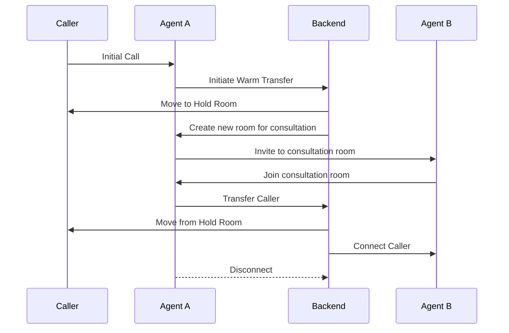

# Warm Transfer MVP

This project is a proof-of-concept application that demonstrates a warm call transfer feature using LiveKit, Next.js, and a Python backend.

## Features

*   **LiveKit Integration:** Real-time audio/video communication powered by LiveKit.
*   **Warm Transfer:** Allows an agent (Agent A) to consult with another agent (Agent B) before transferring a call.
*   **Hold State:** The caller is placed in a dedicated "hold" room during the transfer.
*   **LLM Integration:** Can be extended to generate call summaries using an LLM like Groq.
*   **Twilio Integration:** (Optional) Can be extended to support transfers to real phone numbers using Twilio.

## How it Works

The warm transfer flow is orchestrated by the Python backend, which manages the LiveKit rooms and participants.



1.  **Initial Call:** A caller connects with Agent A in a LiveKit room.
2.  **Initiate Transfer:** Agent A clicks the "Initiate Warm Transfer" button.
3.  **Hold State:** The backend moves the caller to a dedicated "hold" room.
4.  **Agent Consultation:** The backend creates a new room for Agent A and Agent B to consult. Agent A is redirected to this new room.
5.  **Invite Agent B:** Agent A invites Agent B to the new room.
6.  **Complete Transfer:** After the consultation, Agent A clicks the "Transfer Caller" button.
7.  **Final Connection:** The backend moves the caller from the "hold" room to the room with Agent B. Agent A is disconnected.

## Setup

### 1. Environment Variables

You will need to create a `.env` file in the `backend` directory with the following environment variables:

```
LIVEKIT_API_KEY="your_livekit_api_key"
LIVEKIT_API_SECRET="your_livekit_api_secret"
LIVEKIT_URL="your_livekit_url"
GROQ_API_KEY="your_groq_api_key"
TWILIO_ACCOUNT_SID="your_twilio_account_sid"
TWILIO_AUTH_TOKEN="your_twilio_auth_token"
TWILIO_PHONE_NUMBER="your_twilio_phone_number"
NGROK_URL="your_ngrok_url"
```

### 2. Frontend

You will also need to create a `.env.local` file in the `frontend` directory with the following environment variable:

```
NEXT_PUBLIC_LIVEKIT_URL="your_livekit_url"
```

## Running the Application

### 1. Backend

To run the backend, navigate to the `backend` directory and run the following commands:

```bash
pip install -r requirements.txt
uvicorn main:app --reload
```

### 2. Frontend

To run the frontend, navigate to the `frontend` directory and run the following commands:

```bash
npm install
npm run dev
```


